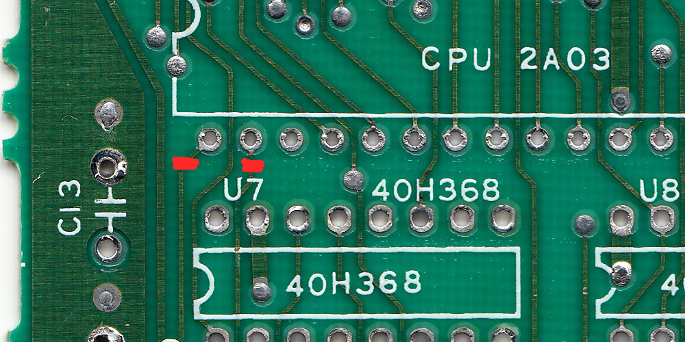
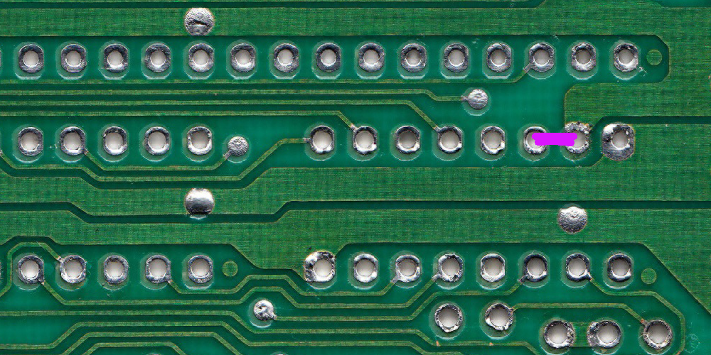
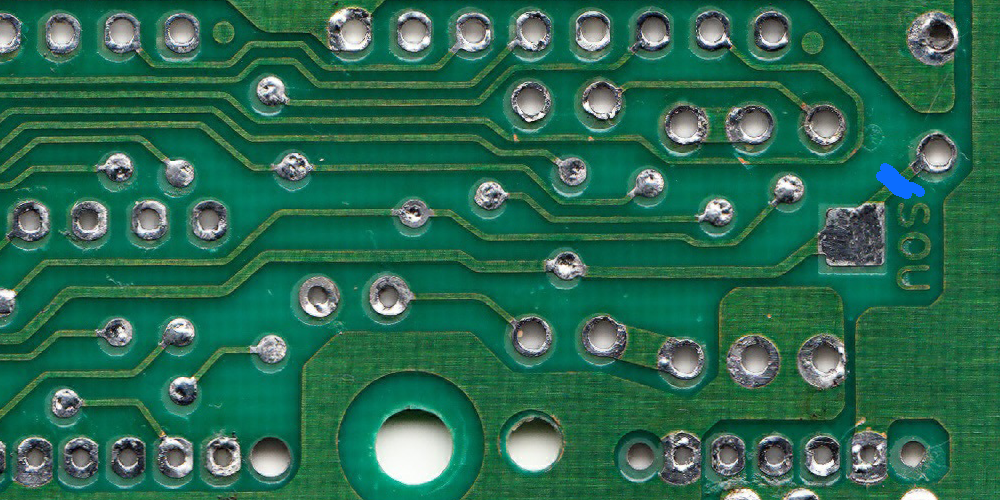
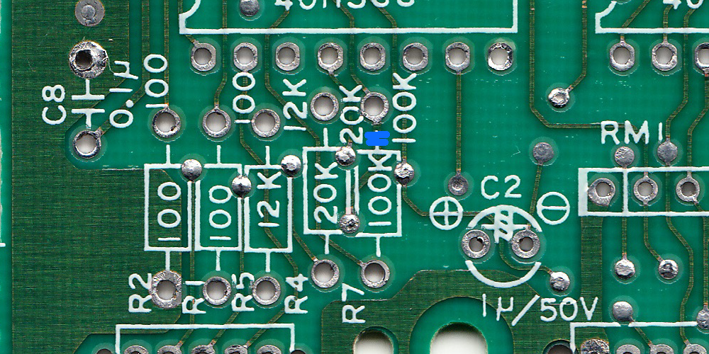
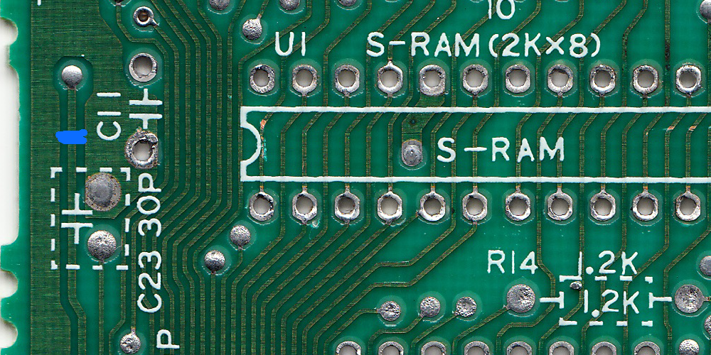

# squeeki-kleen! Audio FC

an open-source hardware external preamp modboard for the NES and FamiCom

## About

A few months ago, I discovered the main source of noisy interference for the audio in the FamiCom, which is the hex inverter chip. The other signals passing through the hex inverter chip is the interference heard in the audio.

Therefore, to reduce the interference as much as possible, the APU pins and preamp circuit must be completely isolated from the hex inverter chip. This is where this modboard comes in.

Note that this KiCad project is optimized for JLCPCB manufacturing, so you may have to modify how the gerber files are generated, remove the part number silkscreen on the back, etc.

	

## Installation

This demonstration uses the RF FamiCom motherboard, revision CPU-07. However, these requirements can be easily adapted to different consoles and motherboard revisions, such as the NES.

This demonstration also uses an earlier revision board, so the look may differ, but the instructions should remain the same.

Here is the full motherboard overview of what modifications need to be done:

### Instructions

1. Isolate Pin 1 and 2 of the 2A03 by cutting their traces as shown:

	

2. Short the input of the stock preamp circuit to ground (solder bridge violet, pins 14 and 15 of U7)

	

3. Isolate the output of the stock preamp circuit and the old audio path (cut blue)
	- Cut the trace after the `SOU` test pad
	- Cut the trace of R7 before it goes to pin 13 of U7
	- Isolate the via near C11, which leads to pin 45 of the cartridge slot. This prevents the leftover trace leaving the `SOU` test pad acting as an antenna to unwanted interference near the bus traces.

	
	
	

Once these are done, simply install the board underneath the 2A03, and connect the output pad to the appropriate output path.

### Connecting the output

When installed, it will look something similar to this:

Note that this is a v0.9 prototype, where the output goes to the left. *The latest version's output goes to the right*.

Jump the output to pin 45 of the cartridge connector in order for the audio to be mixed with cartridge expansion audio as follows:

	

## License

This is licensed under the [TAPR Open Hardware License](http://www.tapr.org/OHL).

Copyright Persune 2026.

## Credits

Special thanks to:

- The NESDev and MDFourier community for advice and help
- [@tianfeng33](https://github.com/tianfeng33) for help with the preamp circuit
- konakonaa for the squeeki-kleen! namesake
- [@Lockster-Inc](https://github.com/Lockster-Inc) for the FamiCom PCB scans

## Support

If you enjoy this project or find it helpful, please support me on [Ko-Fi](https://ko-fi.com/persune) or [Patreon](https://www.patreon.com/persune)!
